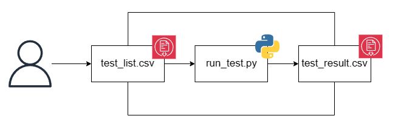

# Test Cases Script
The `Test Cases Script` is a python script which, given `indipendet factors (cluster configuration parameters)`, runs a `TestDFSIO Benchmark` on a `Single-Node Hadoop Cluster` set in `Pseudo-Distributed Mode`. Besides, the script measures the `response variables` : 
* `Online Test` (not implemented yet) performed simultaneosly with TestDFSIO.
* `Offline Test` performed an the end of TestDFSIO  exectuion.

## Test Flow
The user follows the following test flow :
* Writes the cluster configuration parameters and TestDFSIO flags in `test_list.csv` file.
* Starts the `run_test.py` script.
* Reads response variables from `test_result.csv` file.

  

## Table of Contents
1. [Apache Hadoop](doc/Hadoop.md)
    * [Introduction](doc/Hadoop.md#intro)
    * [HDFS](doc/Hadoop.md#hdfs)
    * [MapReduce](doc/Hadoop.md#mapred)
    * [YARN](doc/Hadoop.md#yarn_p)
    * [Hadoop Cluster Configurarion](doc/Hadoop.md#clusterconfig)
    * [TestDFSIO](doc/Hadoop.md#testdfsio)
1. [Environment Setup](doc/Setup.md)
    * [Tools](doc/Setup.md#tool)
    * [Building Hadoop](doc/Setup.md#build)
    * [Setting up the Hadoop Cluster](doc/Setup.md#cluster)
1. [Script in detail](doc/Script.md)
    * [Control Flow](doc/Script.md#flow_control)
    * [Script Structure](doc/Script.md#script_struc)
    * [Python Modules](doc/Script.md#python_mod)
    * [How to Run](doc/Script.md#run)
1. [Experiments](doc/Experiments.md)
    * [Response Variables Analysis](doc/Experiments.md#rv_analysis)
1. [Troubleshooting](doc/Troubleshooting.md)
1. [References](doc/References.md)
    * [Further References](doc/References.md#fref)