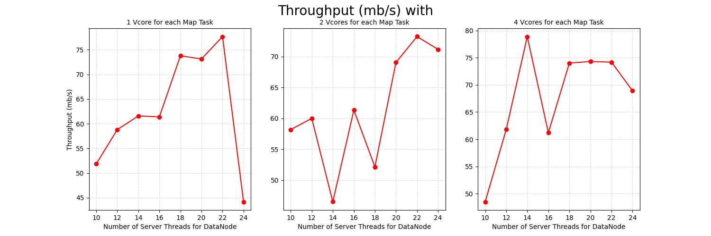
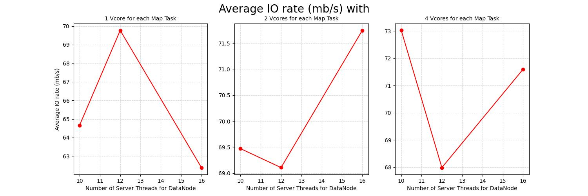

# Experiments
I have conducted a `full factorial experiment 329`, which consists of `2 independent factors`, each with `3 levels`. For each of the 9 combinations, were carried out `9 repetitions`, resulting in a total of 81 experiments. 
The chosen independent factors are related to the computation field and are: 
* `dfs.datanode.handler.count` : The number of server threads for the datanode, with the following levels
  * 10 (default value)
  * 12
  * 16
* `mapreduce.map.cpu.vcores` : The number of virtual cores to request from the scheduler for each map task, with the following levels
  * 1 (default value)
  * 2
  * 4 

The levels depend on the `cluster configuration`; regarding the number of vCores, it cannot exceed the value defined by yarn.nodemanager.resource.cpu-vcores parameter.

On the other hand, the `response variables` are related to the time analysis :
* `Number of map tasks`
* `CPU time spent by the map tasks` : Total time that the all map tasks have spent executing on CPU's
* `CPU time spent by the reduce tasks` : Total time that the all reduce tasks have spent executing on CPU's
* `CPU time spent by the mapreduce framework` : Total time that the all map and reduce tasks have spent executing on CPU's
* `TestDSFIO Average IO rate mb/sec`
* `TestDSFIO Throughput mb/sec`

## Response Variables Analysis 
Subsequently, the following graphs were designed to visualize the results.

