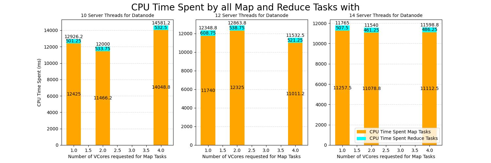
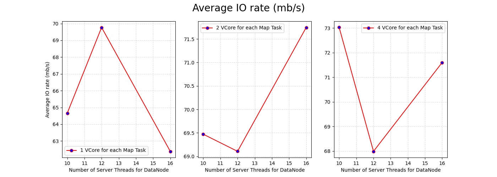

# Experiments
I have conducted a `full factorial desing` 329, which consists of `2 independent factors`, each with `3 levels`. For each of the 9 combinations, were carried out `9 repetitions`, resulting in a total of 81 experiments. All experiments were `write operations` with 10 files and a file size of 100 MB.

The chosen independent factors are related to the computation field and are: 
* `dfs.datanode.handler.count` : The number of server threads for the datanode, with the following levels
  * 10 (default value)
  * 12
  * 16
* `mapreduce.map.cpu.vcores` : The number of virtual cores to request from the scheduler for each map task, with the following levels
  * 1 (default value)
  * 2
  * 4 

The levels depend on the `cluster configuration`.

On the other hand, the `response variables` are related to the time analysis :
* `Number of map tasks`
* `CPU time spent by the map tasks` : Total time that the all map tasks have spent executing on CPU's
* `CPU time spent by the reduce tasks` : Total time that the all reduce tasks have spent executing on CPU's
* `CPU time spent by the mapreduce framework` : Total time that the all map and reduce tasks have spent executing on CPU's
* `TestDSFIO Average IO rate mb/sec`
* `TestDSFIO Throughput mb/sec`

## Response Variables Analysis 
* `Number of Map Tasks` : Its value is constant across all experiments and matches the TestDFSIO files number (TestDFSIO is designed in such a way that it will use one map task per file).
* `Throughput` : In order to conduct a more detailed study, were considered additional points.

  

* `CPU Time Spent by all Map and Reduce Tasks`

  

* `Average IO Rate`

  

