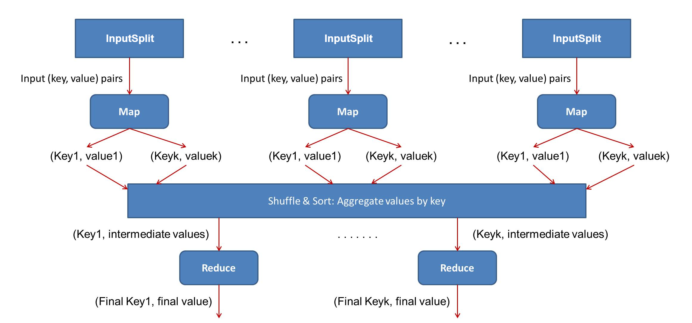

# Apache Hadoop

## Introduction <a name="intro"></a>
Apache Hadoop software library <sup>[[1]](References.md#hadoop)</sup> is a `framework` used for the distributed processing of massive datasets across `clusters` of commodity hardware. `Hadoop Cluster` is a computational cluster used for storing and analyzing huge amounts of unstructured or structured data in a distributed computing environment. 

The Hadoop architecture has three layers :
* `HDFS` : The Storage layer.
* `YARN` : The Resource Management layer.
* `MapReduce` : The Application layer.

<p align="center">
  
</p>

and has a `master-slave` architecture<sup>[[2]](References.md#hadoop_architecture)</sup> :
* `Master Node` : There is one per cluster. It assigns tasks to the slave nodes and stores metadata, managing the resources across the cluster.
* `Slave Nodes` : Store data and perform the computing.

Master and slaves nodes contain the components related to the previous three layers.

<p align="center">
  
</p>


## HDFS <a name="hdfs"></a>
HDFS (Hadoop Distributed File System)<sup>[[4]](References.md#hdfs_architecture)</sup> is a java-based distributed file system running on commodity hardware which supports a traditional hierarchical file organization. This file system :
* Stores user data in files.
* Splits file in one or more 128 MB blocked-sized chunks known as `data blocks` (size is configurable per file).  
* Replicates the data blocks with a `configurable replication factor` (3 by default). The default factor causes an 200% overhead in storage space and other resources, so to avoid the overhead is used the the `Erasure Coding`. It provides the same level of fault-tolerance with much less storage space.

HDFS has a `master-slave architecture` :
* `NameNode` : Master daemon, there is one per cluster. It executes file system namespace operations (opening, closing, and renaming files and directories) and handles clients access to files. The NameNode assigns the blocks to DataNodes and stores the metadata (number of data blocks,their locations,numeber of replicas, etc...). Finally, it makes all decisions regarding blocks replication.
* `DataNode` : Slave daemon, there is one per node in the cluster. It executes read/write operation from the file system’s client. The DataNode performs data blocks operations (creation, deletion and replication) and stores the actual data. Moreover, DataNodes ara gathered together in `racks`.

<p align="center">
  
</p>

The architecture can be `rebalanced` moving data from one Datanode to another.


## MapReduce <a name="mapred"></a>
MapReduce<sup>[[2]](References.md#hadoop_architecture)</sup><sup>[[5]](References.md#mapred_tutorial)</sup> is a software framework for writing applications (which need not be written in Java) that process large datasets in parallel on large clusters. The framework works on sets of `<key,value> pairs`.

A `MapReduce job` is a unit of work the client wants to perform: 
* It takes as inputs a fixed-size splits, divided by Hadoop, known as `InputSplit (or splits)`. 
* It is is an execution of `map tasks` and `reduce tasks`. Each map/reduce task uses a user-defined `map/reduce function` which is implemented through interfaces and/or abstract-classes. MapReduce creates a map task for each split, instead the number of reduce task can be set by the user (set as zero if no reduction is desired).

MapReduce has two phases<sup>[[5]](References.md#mapred_tutorial)</sup><sup>[[6]](References.md#mapred_flow)</sup> : 
* `Map Phase` : Maps the input <key,value> pair to zero or multiple `intermetdiate <key,value> pairs`.
* `Shuffle & Sort` : Fetches the values of the output of the mappers and groups the intermediate pairs by keys.
* `Reduce Phase` : Reduces set of intermediate values, which share a key, to a `smaller set of values`. The smaller set is the final output.

<p align="center">
  
</p> 

## YARN <a name="yarn_p"></a>
YARN (Yet Another Resource Negotiator)<sup>[[7]](References.md#yarn)</sup><sup>[[8]](References.md#yarn_intro)</sup><sup>[[9]](References.md#yarn_tutorial)</sup> is a freamwork for distributed computing which separates resorse menagement and processing components. YARN :
* Allows the exectution of an `application` (`single MapReduce job` or `DAG of jobs`). 
* Sends computations where the data is stored on local disks (property of `data locality`)
* Uses the `containers`, collection of all the resources necessary to run an application on a node in a cluster.

YARN has a `master-slave nodes architecture` :
* `ResourceManager` : The `master daemon` runs on master node. It manages the resources among all the applications in the system. The daemon assigns map and reduce tasks to the NodeManager and schedules containers. The ResourceManager has two main components :
    * `Scheduler` : It is a pure scheduler (does not perform monitoring or tracking of the applications' status), it allocates resources or container to the running applications.
    * `ApplicationsManager` : Accepts `job submissions` by the clients<sup>[[10]](References.md#yarn_app)</sup> and secures resources on a node (an operation known as "`negotiating the first container`") to launch the ApplicationMaster.
* `NodeManager` : The `slave deamon` runs on the worker node. It launches, manages and monitors resource usage of the containers on a node.
* `ApplicationMaster` : It is a framework specific library, so there is one per application. The ApplicationMaster negotiates resources for the running application from the ResourceManager and works with the NodeManager to execute and monitor the tasks. 

<p align="center">
  
</p> 

ResourceManager/NodeManager rapresents the `data-computation framework`.

YARN supports the following schedulers<sup>[[8]](References.md#yarn_intro)</sup> :
* `FIFO` : Allocates resources based on arrival time.
* `Capacity scheduler` (default in hadoop) : Allocates resources to pools or queues, with FIFO scheduling to each pool.
* `Fair scheduler` : Organizes applications into queues or pools and allows to share resources fairly between quees (every application belongs to a queue). It grants container with the least amount of allocated resources.


## Hadoop Cluster Configuration <a name="clusterconfig"></a>
A Hadoop cluster is highly configurable through the parameters settings and the supported modes.

### Supported Modes
Hadoop supports three different modes<sup>[[11]](References.md#modes)</sup> :
* `Standalone Mode` : Hadoop is configured to run in a single-node as a single process on a single Java Virtual Machine (run on a single Java process). This mode is used for testing and debugging.
* `Pseudo-distributed Mode` : All the daemons run on different Java processes. This mode uses only a single node and the cluster is simulated, so  all the processes inside the cluster runs independently to each other.
* `Fully-Distributed Mode` : There are multiple nodes used to run master and slaves deamons and the data are distributed across the different nodes.

### Parameters Settings
The parameters can be configured in the `site-specific configuration files`, such as:
* core-site.xml.
* hdfs-site.xml.
* mapred-site.xml.
* yarn-site.xml.

Furthermore, Hadoop provides the `read-only default configuration files` with default parameter values:
* core-default.xml.
* hdfs-default.xml. 
* mapred-default.xml.
* yarn-default.xml.

These values are used when the parameters are not explicitly set in the **-site.xml* files.

## TestDFSIO <a name="testdfsio"></a>
TestDFSIO benchmark is a `read and write test` for HDFS<sup>[[12]](References.md#dfsio)</sup> and describes how faster a cluster is in terms of I/O. Benchmark results are saved in *TestDFSIO_results.log* file (in the current local directory) and printed to stdout.

The benchmark syntax is the following
```bash
$ $HADOOP_HOME/bin/hadoop jar $HADOOP_HOME/share/hadoop/mapreduce/hadoop-*test*.jar TestDFSIO -read | -write | -clean [-nrFiles N] [-fileSize MB] [-resFile resultFileName] [-bufferSize Bytes]
```
with the following flags :
* `-write` : To run the write test.
* `-read` : To run the read test. 
* `-clean` : To clean up test results.
* `-nrFiles` : The number of files (equal to the number of map tasks).
* `-fileSize` : The size of a file to generate B|KB|MB|GB|TB is allowed.
* `-resFile` : Set the file name where the results will be saved
* `-bufferSize` : The buffer size flag describes the length of the write buffer in bytes

> [!NOTE]
>It is convenient, at the first, run a write test and then run the read test using the same parameters.
