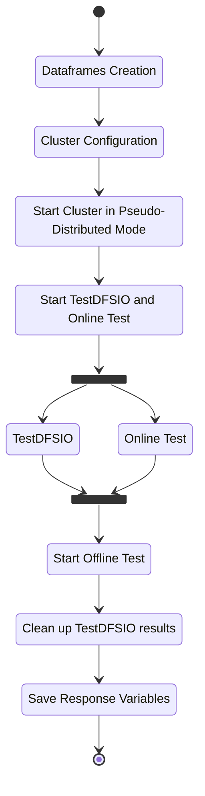

# Script in detail

## Control Flow <a name="flow_control"></a>


## Script Structure <a name="script_struc"></a>
The Test Cases Script has 5 different files :
* `script/hdfs_test.py` : Python "main" script.
* `script/hdfs_test_utils.py` : Python file which holds the functions implementations.
* `script/start_hadoop_cluster.sh` : Bash script which holds the line commnds to stop and start the hadoop cluster.
* `script/hdfs_test_conf.py` : Holds the configuration variables, e.g.:
    * `test_lists/test_list_columns`: for factors definition
    * `test_lists/test_list_num_repetitions`: specify the number of repetitions for each line in `test_lists/test_list.csv`
    * `df_test_result_columns`: format of output file
* `test_lists/test_list.csv` : CSV file which holds the independednt factor values.

## Python Modules <a name="python_mod"></a>
* `xml.etree.ElementTree` : Module for parsing and creating XML data.
* `subprocess` : Module to spawn new processes and capture stout/stderr.
* `pandas` : Module for data manipulation and analysis.
* `os` : Module to use OS-dependent functionality.
* `multiprocessing` : Module to spawn new processes.
* `requests` : For HTTP requests

## How to Run <a name="run"></a>
### Prerequisites
1. Set independent factors in `hdfs_test_config.py`
2. Generate test list template with;
    ``` console
    $ python -c "import hdfs_test_utils; hdfs_test_utils.gen_test_list_header(\"<filename>\")"
    ```
3. Set test list name `path_test_list=<filename>` in `hdfs_test_config.py`
3. Set factors values in lines of test list file.
4. Set variables in `hdfs_test_conf.py`.

### Run
```bash
$ cd script
$ python3 hdfs_test.py
```
Results are available at `test_results/test_results.csv`. Output file can be changed with `path_test_result` in `hdfs_test_config.py`.