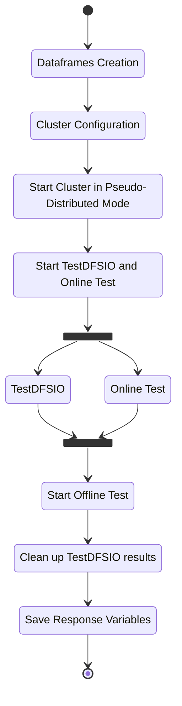

# Script in detail

## Control Flow <a name="flow_control"></a>


## Script Structure <a name="script_struc"></a>
The Test Cases Script has 5 different files :
* `hdfs_test.py` : Python "main" script.
* `hdfs_test_utils.py` : Python file which holds the functions implementations.
* `hdfs_test_conf.py` : Python file which holds the variables needed by the script.
* `start_hadoop_cluster.sh` : Bash script which holds the line commnds to stop and start the hadoop cluster.
* `test_list.csv` : CSV file which holds the configuration paramters.


## Python Modules <a name="python_mod"></a>
* `xml.etree.ElementTree` : Module for parsing and creating XML data.
* `subprocess` : Module to spawn new processes and capture stout/stderr.
* `pandas` : Module for data manipulation and analysis.
* `os` : Module to use OS-dependent functionality.
* `multiprocessing` : Module to spawn new processes.
* `requests` : For HTTP requests


## How to Run <a name="run"></a>
### Prerequisites
* Set indipendent factors and TestDFSIO flags as the first row of `test_list.csv` file.
* Set variables in `hdfs_test_conf.py`.

### Run
```bash
$ cd script
$ python3 hdfs_test.py
```