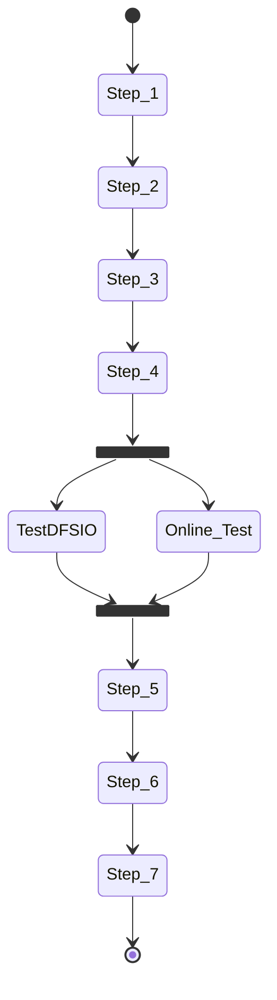

# Test Cases Script

## Script Structure <a name="script_struc"></a>
The Test Cases Script has 5 different files :
* `run_test.py` : Python script to start.
* `functions.py` : Python file which holds the functions implementations.
* `confi_file.py` : Python file which holds the variables needed by the script.
* `start_cluster.sh` : Bash script which holds the line commnds to start the hadoop cluster.
* `test_list.csv` : CSV file which holds the configuration paramters.

## Flow of control <a name="flow_control"></a>
A minimal flow of controll of the script

* `Step_1` : Create all the dataframes needed for the script.
* `Step_2` : Cluster Configuration.
* `Step_3` : Start the cluster in pseudo-distributed mode.
* `Step_4` : Start the TestDFSIO, the python program generates two `child processe` (throught the system call fork()) and the join() method blocks until the processes are terminated.
    * `TestDFSIO` : Start TestDFSIO
    * `Online_Test` : Start Online Test to measure the response variables (not implemented yet).
* `Step_5` : Start the Offline Test to measure the response variables.
* `Step_6` : Clean up test results.
* `Step_7` : Save response variables on test_result.csv.


## Python Modules <a name="python_mod"></a>
* `csv` : Module to work with csv files.
* `pandas` : Module for data manipulation and analysis.
* `xml.etree.ElementTree module` : Module for parsing and creating XML data.
* `subprocess` : Module to spawn new processes and capture stout/stderr.
* `os` : Module to use operating system dependent functionality.
* `multiprocessing` : Module to spaw new processes.


## Functions <a name="func"></a>

### create_dataframe(test_list.csv file path) 
* `Description` : Create all the dataframes needed for the script (`Step 1`).
* `Implementation` :
```python
def create_dataframe(path_test_list):

    # Read test_list.csv
    df_test_list = pandas.read_csv(path_test_list)                 

    # Create custum indeces
    tests_number = []
    for i in range(1,len(df_test_list.index)+1):
        string = 'test' + str(i)
        tests_number.append(string)

    df_test_list.index = tests_number

    # Create dataframe for test_result.csv
    df_test_result = pandas.DataFrame()                     
    df_test_result.index = tests_number

    # Dataframe to store response variables from mapreduce commands
    df_mapred_commands = pandas.DataFrame()                   
    df_mapred_commands.index = tests_number
    
    # Dataframe to store response variables from TestDFSIO logs 
    df_dfsio_logs = pandas.DataFrame()                  
    df_dfsio_logs.index = tests_number

    return df_test_list,df_test_result,df_mapred_commands,df_dfsio_logs
```

### config_cluster(hdfs-site.xml file path, hdfs parameters tuple, mapred-site.xml file path, mapred parameters tuple, yarn-site.xml file path, yarn parameters tuple, test_list dataframe row, cluster configuration special parameters)
* `Description` : Configure the Hadoop cluster by setting *-site.xml* files of the three layers (`Step 2`).
* `Implementation` :
```python
def config_cluster(path_hdfs_site,hdfs_t,path_mapred_site,mapred_t,path_yarn_site,yarn_t,row,special_parameters):
    update_xml(path_hdfs_site,row,hdfs_t,special_parameters)          # Configure hdfs-site.xml
    update_xml(path_mapred_site,row,mapred_t,special_parameters)      # Configure mapred-site.xml
    update_xml(path_yarn_site,row,yarn_t,special_parameters)          # Configure yarn-site.xml
```

### update_xml(xml file path,configuration parameters tuple, cluster configuration special parameters)
* `Description` : Update the specific *-site.xml* file (`Step 2`).
* `Implementation` :
```python
def update_xml(file,row,tuple,special_parameters):    
    tree = ET.parse(file)                                           # Parse the XML file
    root = tree.getroot()  

    for property in root.findall('property'):                       # Remove the previous tags
        name = property.find('name').text                           # Find the tags with the parameters configured for the pseudo-distributed mode 
        if name not in special_parameters:    
            root.remove(property)

    for t in tuple:
        property = ET.Element('property')                           # Create property,name and value elements
        name = ET.Element('name')
        value = ET.Element('value')
        name.text = t                                               # Set the new tags
        value.text = str(row[t])
        root.append(property)                                       # Add the new elements to the root element
        property.append(name)
        property.append(value)                  

    ET.indent(tree, space='  ', level=0)                            # Indent the xml file
                                                                    # level = 0 means that you are starting the indentation from the root
    tree.write(file, encoding="utf-8", xml_declaration=True)        # Write on xml file
```

### os.system(bash script)
* `Description` : Start the single-node cluster in pseudo-distributed mode (`Step 3`).
* `Implementation` :
```python
os.system('./start_cluster.sh')
```
```bash
#!/bin/bash

# Stop HDFS deamons,YARN deamons and JobHistoryServer
$HADOOP_HOME/sbin/stop-dfs.sh                      
$HADOOP_HOME/sbin/stop-yarn.sh
$HADOOP_HOME/bin/mapred --daemon stop historyserver
sleep 4

# Format the filesystem
#$HADOOP_HOME/bin/hdfs namenode -format             
#sleep 5

# Start HDFS deamons,YARN deamons and JobHistoryServer
$HADOOP_HOME/sbin/start-dfs.sh                     
$HADOOP_HOME/bin/hdfs dfsadmin -safemode leave                  # Forcefully let the namenode leave safemode
$HADOOP_HOME/sbin/start-yarn.sh
$HADOOP_HOME/bin/mapred --daemon start historyserver
sleep 2

# Make the HDFS directories required to execute MapReduce jobs
$HADOOP_HOME/bin/hdfs dfs -mkdir /user             
$HADOOP_HOME/bin/hdfs dfs -mkdir /user/$(whoami)
sleep 2

# Copy the input files into the distributed filesystem
$HADOOP_HOME/bin/hdfs dfs -mkdir input
$HADOOP_HOME/bin/hdfs dfs -put $HADOOP_HOME/etc/hadoop/*.xml input
```

### create_dfsio(test_list dataframe row, dfsio parameters tuple)
* `Description` : Create the TestDFSIO and create a new `Python Interpreter Process` through the `system call fork` (`Step 4`).
* `Implementation` :
```python
def create_dfsio(row,dfsio_t):
    s = '$HADOOP_HOME/bin/hadoop jar $HADOOP_HOME/share/hadoop/mapreduce/hadoop-mapreduce-client-jobclient-3.3.5-tests.jar TestDFSIO -' + str(row['dfsio.operation'])
    for t in dfsio_t:
        s = s + ' -' + t.split('.')[1] + ' ' + str(row[t])  

    s = s + ' -resFile ' + conf.path_test_dfsio_logs                        # Add to the string the file path for test results log

    dfsio_process = mp.Process(target = start_dfsio, args=(s,))             # Create the new process
    dfsio_process.start()                                                   # Start the process
    dfsio_process.join()                                                    # Method blocks until the process is terminated

    # Start online test (not implemented yet)
```

### start_dfsio(TestDFSIO command)
* `Description` : Start the TestDFSIO (`Step 4`).
* `Implementation` :
```python
def start_dfsio(string):
    os.system(string)
```


### offline_test(test number, dataframe for rv from mapreduce commands, columns names for th previous dataframe, TestDFSIO log file path, dataframe for rv from TestDFSIO log, columns names for previous dataframe)
* `Description` : Measure the response variables by launching mapreduce commands and reading the TestDFSIO log file (`Step 5`).
* `Implementation` :
```python
def offline_test(index,df_mapred_commands,cn_mapred_commands,path_test_dfsio_logs,df_dfsio_logs,cn_dfsio_logs):

   # Read the response variables from the mapreduce commands
    mapred_commands(index,df_mapred_commands,cn_mapred_commands)

    # Read the response variables from the TestDFSIO logs
    test_dfsio_logs(index,path_test_dfsio_logs,df_dfsio_logs,cn_dfsio_logs) 
```

### mapred_commands(test number,dataframe for rv from mapreduce commands ,columns names for th previous dataframe )
* `Description` : Measure the response variables using mapreduce commands<sup>[[17]](References.md#mapred_commands)</sup> (`Step 5`).
* `Implementation` :
```python
def mapred_commands(index,df_mapred_commands,cn_mapred_commands):
    # Find jobID
    job_id_sub = subprocess.run('$HADOOP_HOME/bin/mapred job -list all | grep "job_"',shell = True ,capture_output=True)
    job_id = job_id_sub.stdout.decode().split('\t')[0]

    #1: Find the number of map tasks
    map_number_sub = subprocess.run('$HADOOP_HOME/bin/mapred job -status ' + job_id + ' | grep "Number of maps"',shell = True ,capture_output=True)
    map_number = int(map_number_sub.stdout.decode().split(':')[1])

    #2: CPU time spent by MapReduce Framework, map tasks and reduce tasks
    cpu_time_sub = subprocess.run('$HADOOP_HOME/bin/mapred job -history ' + job_id + ' | grep "CPU time spent"',shell = True ,capture_output=True)
    cpu_time_map = int(cpu_time_sub.stdout.decode().replace(',','').split('|')[3])
    cpu_time_red = int(cpu_time_sub.stdout.decode().replace(',','').split('|')[4])
    cpu_time_tot = int(cpu_time_sub.stdout.decode().replace(',','').split('|')[5])

    return map_number,cpu_time_map,cpu_time_red,cpu_time_tot
```

### test_dfsio_logs(test number, TestDFSIO log file path, dataframe for rv from TestDFSIO log, columns names for previous dataframe)
* `Description` : Measure the response variables using the TestDFSIO_results.log file (`Step 5`).
* `Implementation` :
```python
def test_dfsio_logs(index,file):
    throughput_line =  5 + (9 * index)                                                  # Position of the lines
    avarege_io_line =  6 + (9 * index)
    throughput_value = float(linecache.getline(file, throughput_line).split(':')[1])    # Get a specific line
    avarege_io_value = float(linecache.getline(file, avarege_io_line).split(':')[1])
    
    return throughput_value,avarege_io_value
```

### clean_up(TestDFSIO log file path)
* `Description` : Clean up the TestDFSIO result and remove log file (`Step 6`).
* `Implementation` :
```python
def clean_up(path_test_dfsio_logs):
    os.system('$HADOOP_HOME/bin/hadoop jar $HADOOP_HOME/share/hadoop/mapreduce/hadoop-mapreduce-client-jobclient-3.3.5-tests.jar TestDFSIO -clean')
    os.remove(path_test_dfsio_logs)
```


### save_rv(test_result file path, dataframe for test_result, dataframe for rv from mapreduce commands, dataframe for rv from TestDFSIO log)
* `Description` : Save response variables on test_result csv file (`Step 6`).
* `Implementation` :
```python
def save_rv(path_test_result,df_test_result,df_mapred_commands,df_dfsio_logs):
    df_test_result = pandas.concat([df_mapred_commands, df_dfsio_logs], axis=1)     # Concatenate pandas objects along a particular axis
    df_test_result.to_csv(path_test_result,index= False)
```

## How to Run <a name="run"></a>
### Prerequisites
Set : 
* Indipendent factors and TestDFSIO flags as the first row of *test_list.csv* file.
* Variables in *config_file.py*

### Run
```bash
$ python3 run_test.py
```

> [!NOTE]
> If the following message "Re-format filesystem in Storage Directory root= /tmp/hadoop-spena/dfs/name; location= null ? (Y or N)" appears on your terminal, choose Y