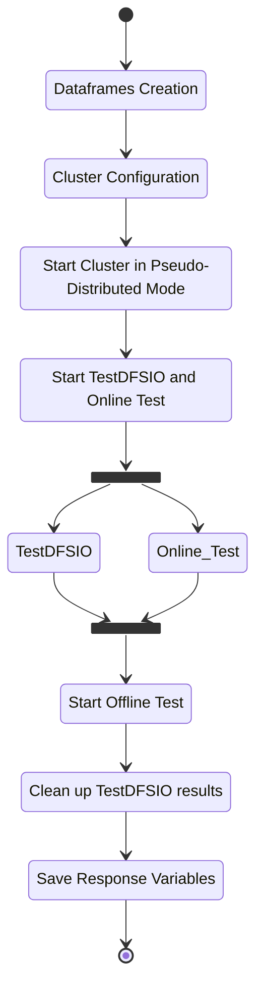

# Test Cases Script

## Script Structure <a name="script_struc"></a>
The Test Cases Script has 5 different files :
* `run_test.py` : Python script to start.
* `functions.py` : Python file which holds the functions implementations.
* `config_file.py` : Python file which holds the variables needed by the script.
* `start_cluster.sh` : Bash script which holds the line commnds to start the hadoop cluster.
* `test_list.csv` : CSV file which holds the configuration paramters.

## Control Flow <a name="flow_control"></a>
A minimal flow of controll of the script



## Python Modules <a name="python_mod"></a>
* `csv` : Module to work with csv files.
* `pandas` : Module for data manipulation and analysis.
* `xml.etree.ElementTree module` : Module for parsing and creating XML data.
* `subprocess` : Module to spawn new processes and capture stout/stderr.
* `os` : Module to use operating system dependent functionality.
* `multiprocessing` : Module to spaw new processes.


## How to Run <a name="run"></a>
### Prerequisites
Set : 
* Indipendent factors and TestDFSIO flags as the first row of *test_list.csv* file.
* Variables in *config_file.py*

### Run
```bash
$ python3 run_test.py
```